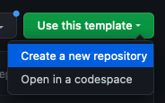
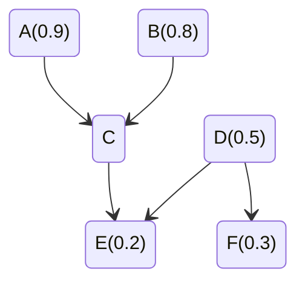
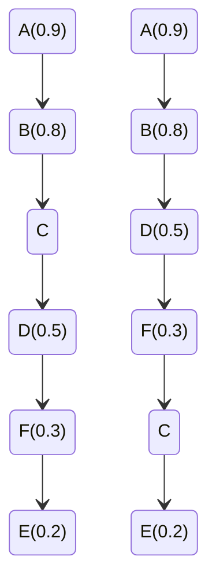

# Tutero Assignment

**Please create a template from this repository!**



Write your source-code in the root of your created repository.

## Context

In this assignment, you will be responsible for providing a learning roadmap for a student named Randy in a topic of mathematics. You are given:

- A knowledge graph (directed acyclic graph), representing all the skills inside that topic; where the parents of a given skill `s` are pre-requisites to knowing `s`, and the children of `s` require the knowledge of `s` to be learnt.
- Randy’s progress in each of the skills. You may assume the range of any skill progress is a percentage (bounded in `[0, 1]`). Progress may also undefined, in which case it should be treated as 0.

The learning roadmap should be a linear ordering of the skills inside the topic, where no skill should appear before any of its pre-requisites. If we have a scenario where two or more skills are interchangeable in the roadmap, we should order by decreasing progress in those skills.

### Example



As `A`, `B` and `D` are all root-nodes with no pre-requisites, they are interchangeable in the roadmap.

Similarly, `E` and `F` are interchangeable - but only when `C` comes before `F`.

Therefore, two valid orderings are:



---

## Assignment

Your job is to make an executable binary that prints the linear ordering to standard output.

This binary should read from a file `input.txt` which will be mounted to the current runtime path of the binary. You should provide a `Dockerfile` that runs this binary, assuming `/usr/src/app` as the working directory. (this means that the `input.txt` will be mounted to `/usr/src/app/input.txt`). You may find an example of this setup in `build-example/` -- feel free to use the `Dockerfile` provided if you are using Go.
- If you're not familiar with Docker, trying building off an example from [here](https://github.com/gauthamp10/dockerfile-boilerplates) for instance, ensuring that `WORKDIR` is `/usr/src/app`.

The structure of `input.txt` is the a list of the following components (in any order) separated by a newline:

- `A->B` indicates that the skill `A` is a parent of `B`.
- `A=0.5` indicates that the progress of skill `A` is `0.5`.

An example could be:

```rust
A->B
B->C
A=0.2
A->D
```

The format of your standard output is the names of the skills in your roadmap, separated by a newline; for instance:

```rust
A
B
D
C
```

---

## Technical Expectations

- Usage of dependencies other than the standard library of the language of your choice is not allowed.
  - This allows you to demonstrate your understanding of basic programming techniques and computer-science
- Your code should be well-tested and performant. You may use the test-runner that we use internally to grade (functional) aspects of the assignment to review your submission.
  - You will need to install Go, install the binary at `runner/main.go` and run it at the root of your assignment containing the `Dockerfile`.
- Readable, idiomatic code.

---

## Submission
- Create a template from this repository
- Version control your assignment on **GitHub**
- Give access to [@rlch](https://github.com/rlch)
- You should send the link to your repository and how much time you took to complete the assignment: sonny@tutero.com.au, richard@tutero.com.au
- Submissions that cannot be run by invoking `docker build -t assignment . && docker run assignment` (given an `input.txt` in the same `/usr/src/app` directory) will not be considered

---

## Tips + Notes

- Use the provided test-runner at `runner/` to verify and benchmark your submission.
- Try your best to use your initiative, but if you have any issues please contact [richard@tutero.com.au](mailto:richard@tutero.com.au)
- We will set up an interview with you after your assignment is complete to go over your code and ask you various questions about your assignment.
